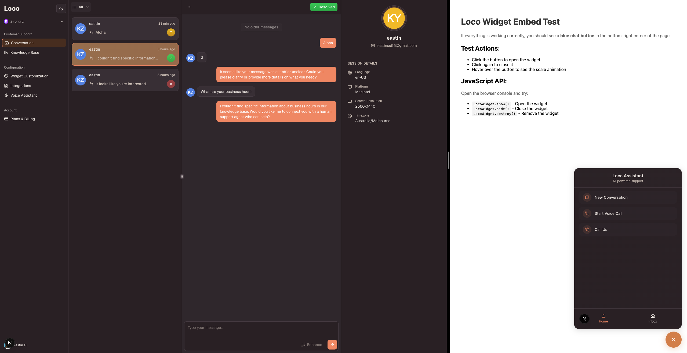

# Loco - AI-Powered Customer Service Platform

An AI-powered customer service platform that lets businesses monitor all customer-AI interactions, build knowledge bases for intelligent responses, and enable direct voice calls with AI agents.



## What It Does

- **Conversation Oversight** - Monitor and review all customer-AI conversations across your organization in real-time
- **Knowledge Base (RAG)** - Upload documents (PDF, images, HTML) to train the AI and answer customer questions accurately
- **Voice Calling** - Customers can call directly to AI agents via Vapi to resolve issues through natural voice conversations
- **Embeddable Widget** - Drop-in chat widget for any website
- **Multi-tenant Dashboard** - Manage conversations, analytics, and settings per organization

## Tech Stack

### Frontend
- Next.js 15 + React 19 + TypeScript
- Tailwind CSS 4 + shadcn/ui
- Jotai (widget state)

### Backend
- Convex (real-time database + serverless functions)
- @convex-dev/agent (AI orchestration)
- @convex-dev/rag (document search)
- OpenAI APIs

### Auth
- Clerk (multi-org authentication)

### Voice
- Vapi AI (voice conversations)

## Project Structure

```
loco/
├── apps/
│   ├── web/          # Dashboard (Next.js)
│   └── widget/       # Embeddable widget (Next.js)
├── packages/
│   ├── backend/      # Convex backend
│   └── ui/           # Shared components
```

## Quick Start

```bash
pnpm install
pnpm dev
```

- Dashboard: `http://localhost:3000`
- Widget: `http://localhost:3001`

## Environment Variables

```env
# Clerk
NEXT_PUBLIC_CLERK_PUBLISHABLE_KEY=
CLERK_SECRET_KEY=

# Convex
NEXT_PUBLIC_CONVEX_URL=

# OpenAI (backend)
OPENAI_API_KEY=

# Vapi (widget)
NEXT_PUBLIC_VAPI_PUBLIC_KEY=
```
